<!--
How to present
- Put this file in presentation/ (next to assets/) so the NotebookLM images resolve.
- VS Code: install the "Marp for VS Code" extension → Open Preview to the Side → Present.
- CLI: npx @marp-team/marp-cli workshop.md --preview
- Speaker notes: Marp preview → "Presenter view" (or export PDF with notes).
- Edit freely: each --- is a slide. Swap/resize images with . Delete the Appendix if you don't want K8s/Podman.

Audience follows WORKSHOP.md in VS Code + Runme. Pause on every NOW cue.
-->

<!-- _class: lead -->

# Docker Basics
Interactive Workshop

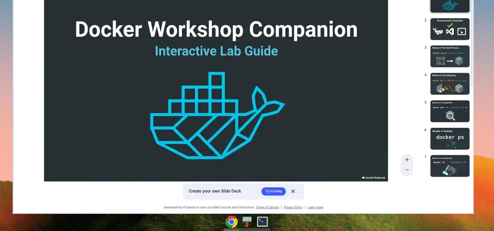

<p class="muted">30–45 min · Linux · VS Code + Runme<br>You present. They click ▶ in <code>WORKSHOP.md</code>.</p>

<!--
Welcome. Participants should already have the repo open. Keep pace with the green NOW boxes — don't advance until most people have finished the matching cells.
-->

---

# How this session works

<div class="cols">
<div>

### You
- Concepts first, then the command
- Watch for hands / chat
- Advance only when most cells are done

</div>
<div>

### Them
- Open `WORKSHOP.md` as a Runme notebook
- ▶ each cell, **top to bottom**
- Sudo password when a cell asks

</div>
</div>

> **NOW:** Confirm VS Code is open, this repo is the folder, and `WORKSHOP.md` is a Runme notebook — not plain markdown.

<!--
If a file opens as text: right-click → Open With → Runme.
Extension: Ctrl+Shift+X, search Runme (Stateful).
-->

---

# Pre-flight

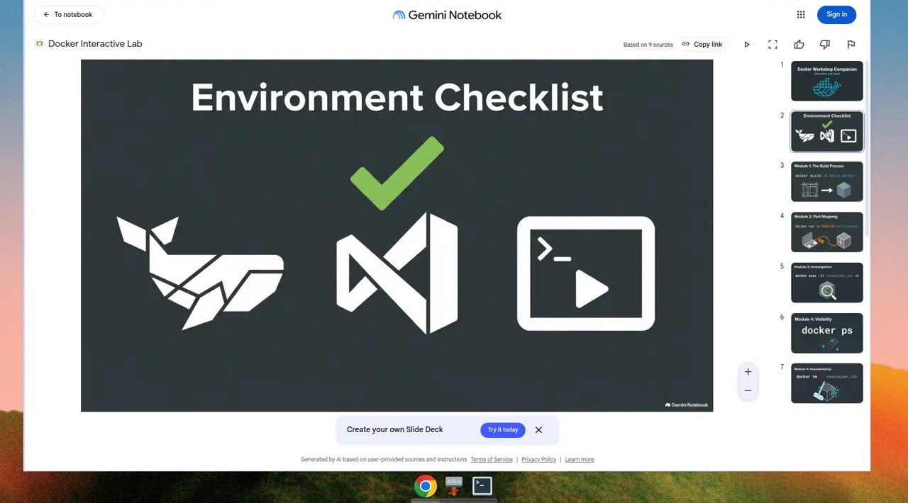

| Check | Details |
|---|---|
| Linux | Ubuntu/Debian — workshop uses `apt` |
| VS Code + Runme | Stateful Runme extension |
| Ports free | `8080` (hello-docker) · `8081` (compose-demo) |
| Sudo | Module 0 installs Docker |
| Internet | Pulls `nginx` and `redis` images |

<div class="warn">Ask: who already has Docker working? They can skim Module 0, but must still verify <code>docker compose version</code>.</div>

<!--
Show of hands saves 5 minutes. Compose v2 is the Module 5 blocker.
-->

---

# Agenda

| # | Topic | Time |
|---|---|---|
| 0 | Install Docker, Buildx, Compose v2 | 5–10 min |
| 1 | Build an image from a Dockerfile | 5–7 min |
| 2 | Run, exec, logs | 8–10 min |
| 3 | Commit a container *(optional)* | 5 min |
| 4 | Stop, start, rm, rmi | 5–7 min |
| 5 | Compose + bridge networks | 10–12 min |
| 6 | Cleanup | 3 min |

<!--
Module 3 is collapsed in WORKSHOP.md. Skip it if the install ran long.
-->

---

# Core concepts

<div class="cols-viz">
<div>

### Image
Read-only template — filesystem + metadata. Built from a **Dockerfile**.

### Container
A running (or stopped) instance of an image. Isolated process + its own filesystem layer.

<p class="muted">Image = class · container = object</p>

</div>
<div>

```
Dockerfile  ──build──▶  Image  ──run──▶  Container
 (recipe)              (template)         (instance)
```

</div>
</div>

<!--
Keep this short. They'll feel it in Modules 1–2. Mention layers/cache when they build.
-->

---

# Module 0 <span class="badge">5–10 min</span>

## Install & verify Docker

- `docker.io` — Engine
- `docker-buildx` — modern builder
- `docker compose` — **v2** (space, not hyphen)

```bash
sudo apt update && sudo apt install -y docker.io docker-buildx
sudo apt install -y docker-compose-v2
sudo systemctl start docker && sudo systemctl enable docker
docker --version && docker compose version && docker buildx version
```

> **NOW:** Run Module 0 cells in order — Install Docker → Compose → Enable service → Verify.

<!--
Slowest module. Walk the room while apt runs. Two failures: socket permission, compose not found.
-->

---

# Module 0 — Troubleshooting

<div class="cols">
<div>

### Permission denied

```bash
sudo chown $USER /var/run/docker.sock
```

Then re-run **Docker daemon info**.

<p class="muted">Permanent fix (optional): <code>usermod -aG docker $USER</code> + re-login. For today, chown is faster.</p>

</div>
<div>

### Compose not found

Re-run **Install Compose v2 plugin**.

Must print `docker compose version` **v2.x**.

<p class="muted">If Docker came from Docker’s apt repo: <code>sudo apt install -y docker-compose-plugin</code></p>

</div>
</div>

<div class="warn">Do not start Module 1 until <code>docker info</code> and <code>docker compose version</code> both succeed. Module 5 needs Compose.</div>

---

# Module 1 <span class="badge">5–7 min</span>

## Creating an image

Look at `examples/hello-docker/`

<div class="cols-viz">
<div>

```dockerfile
FROM nginx:alpine
COPY app/index.html /usr/share/nginx/html/index.html
```

```bash
docker buildx create --use --name workshop-builder
cd examples/hello-docker
docker buildx build --load -t hello-docker:1.0 .
docker images hello-docker
```

Each instruction is a cached **layer**. `--load` writes the image to the local engine.

</div>
<div>

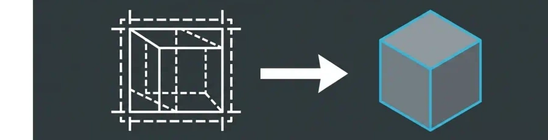

</div>
</div>

> **NOW:** Set up Buildx → Build `hello-docker:1.0` → list the image.

<!--
Tiny Dockerfile on purpose. Point at the layer steps in the build output. The tag is what later modules use.
-->

---

# Module 2 <span class="badge">8–10 min</span>

## Run a container — port mapping

<div class="cols-viz">
<div>

```bash
docker run -d --name hello -p 8080:80 hello-docker:1.0
docker ps
curl -s localhost:8080
```

| Flag | Meaning |
|---|---|
| `-d` | Detached |
| `--name hello` | Human name |
| `-p 8080:80` | Host → container |

Host `8080` hits nginx `80` inside the container.

</div>
<div>

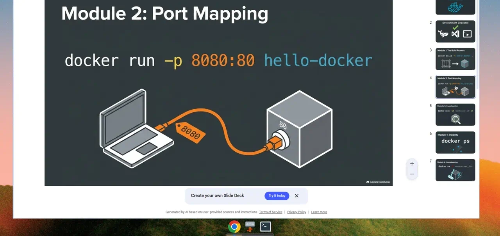

</div>
</div>

> **NOW:** Run the container → `docker ps` → `curl localhost:8080`. Expect “Hello from Docker!”

<!--
If curl fails: container not running, or 8080 already taken.
-->

---

# Module 2 — Exec & logs

<div class="cols-viz">
<div>

**One-shot command**

```bash
docker exec hello cat /usr/share/nginx/html/index.html
```

**Interactive shell** (`-it` = interactive + TTY)

```bash
docker exec -it hello sh
# hostname   ls /usr/share/nginx/html   exit
```

```bash
docker logs hello
```

</div>
<div>


</div>
</div>

> **NOW:** Exec cells + interactive shell (~2 min to poke around) + logs.

<!--
logs should show the nginx access lines from their curl. Same container they just started — exec is not a new container.
-->

---

# Module 3 <span class="badge">optional · 5 min</span>

## Snapshot a running container

`docker commit` freezes the container filesystem as a **new image**. Handy for debugging. Prefer a Dockerfile for anything you want to reproduce.

```bash
docker exec hello sh -c 'echo "committed-layer" > /tmp/marker'
docker commit hello hello-docker:committed
docker run --rm hello-docker:committed cat /tmp/marker
```

> **NOW:** Expand “Module 3” in `WORKSHOP.md` and run the commit cells — or skip if you’re short on time.

<!--
Collapsed under <details> in the notebook. Skip without guilt if Module 0 ran long.
-->

---

# Module 4 <span class="badge">5–7 min</span>

## See what’s running

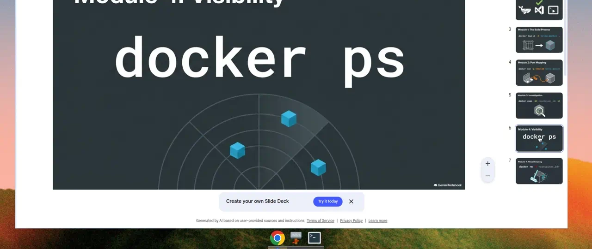

```bash
docker ps          # running
docker ps -a       # running + stopped
```

> **NOW:** `docker ps` then `docker ps -a`. Same container, two views.

<!--
They'll need ps -a after they stop hello in a moment.
-->

---

# Module 4 — Lifecycle

<div class="cols-viz">
<div>

```bash
docker stop hello           # graceful stop
docker start hello          # same container, back up
docker rm -f hello          # delete the container
docker rmi hello-docker:1.0 # delete the image
```

- Remove the **container** before the **image**
- `rm -f` works on running or stopped
- `docker image prune -f` is optional dangling-layer cleanup

</div>
<div>

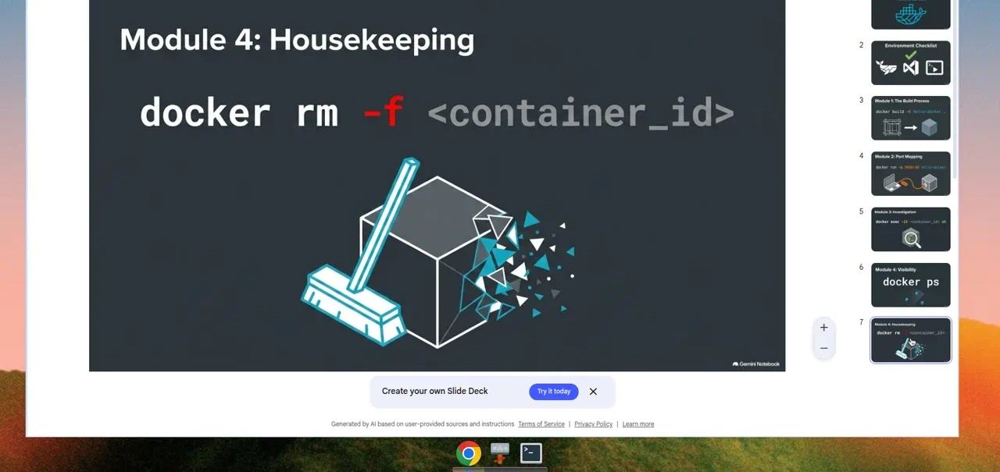

</div>
</div>

> **NOW:** Stop → start → `rm -f` → `rmi`. Image delete fails if the container still exists.

<!--
Most common error of the day: rmi while hello is still around.
-->

---

# Module 5 <span class="badge">10–12 min</span>

## Compose + bridge networks

`examples/compose-demo/` — one YAML, three services.

<div class="cols-viz">
<div>

```
Browser :8081
    │
    ▼
 [ web / nginx ] ── frontend ── [ api ]
                                   │
                               backend
                                   │
                                [ redis ]
```

- **web** — reverse proxy, only published port (`8081`)
- **api** — Python health + hit counter (both networks)
- **redis** — backend only, not on the host

</div>
<div>


</div>
</div>

<!--
Point of the lab: you cannot curl redis or api from the host. nginx proxies /api/ internally.
-->

---

# Module 5 — The compose file

```yaml
networks:
  frontend: { driver: bridge }
  backend:  { driver: bridge }

services:
  web:    ports: ["8081:80"]     networks: [frontend]
  api:    networks: [frontend, backend]
  redis:  networks: [backend]
```

`api` is the only service on **both** networks. Redis has no published ports.

> **NOW:** `docker compose config` → `docker network ls` → `docker compose up -d --build --wait`

<!--
config validates YAML. --wait blocks on the api healthcheck. First build is Q&A time.
-->

---

# Module 5 — Bring it up

<div class="cols-viz">
<div>

```bash
cd examples/compose-demo
docker compose up -d --build --wait
curl -s localhost:8081
curl -s localhost:8081/api/health
```

Hit `/api/health` a few times — `redis_hits` should climb.

```json
{"status":"ok","hostname":"…","redis_hits":3}
```

</div>
<div>


</div>
</div>

> **NOW:** curl the page + health (repeat health). Then `docker compose ps` and inspect `compose-demo_frontend`.

<!--
If health hangs: Compose v2 missing, or wait/healthcheck. Re-run Module 0 compose install.
-->

---

# Module 5 — Tear down

```bash
cd examples/compose-demo
docker compose down --volumes --remove-orphans
```

- `down` — containers **and** the compose networks
- `--volumes` — named/anonymous volumes
- `--remove-orphans` — leftovers from older compose files

> **NOW:** Tear down before Module 6. `docker network ls` should no longer show `compose-demo_*`.

---

# Module 6 <span class="badge">3 min</span>

## Leave the machine as you found it

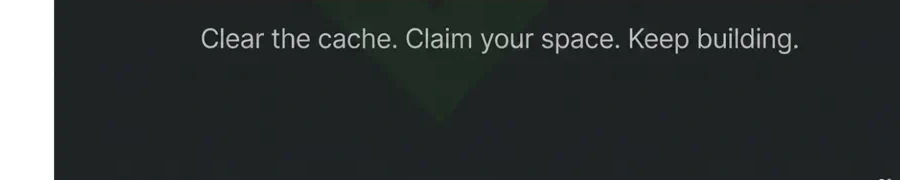

```bash
docker rm -f hello
docker compose -f examples/compose-demo/docker-compose.yml down --volumes --remove-orphans
docker rmi hello-docker:1.0 hello-docker:committed
docker rmi compose-demo-web compose-demo-api
```

> **NOW:** Run all three cleanup cells. Remaining workshop containers/images should print `(none)`.

<!--
Idempotent. Safe to re-run. Teach the habit.
-->

---

# You did it

- Built images with Dockerfile + Buildx
- Ran containers, exec’d in, read logs
- Managed lifecycle — stop / start / rm / rmi
- Multi-service apps with Compose
- Bridge networks for isolation

<p class="muted">Typical aha moments: port mapping, internal DNS (<code>api</code>, <code>redis</code>), layer cache.</p>

---

# Challenge

Change `examples/hello-docker/app/index.html`, rebuild, run a new container.

```bash
cd examples/hello-docker
docker buildx build --load -t hello-docker:2.0 .
docker run -d --name hello-v2 -p 8080:80 hello-docker:2.0
curl -s localhost:8080
```

<p class="muted">Editing the file is not enough — the running container still has the old layer. Rebuild, then run.</p>

<!--
Live if time. Otherwise homework.
-->

---

# Questions?

<p class="muted"><code>WORKSHOP.md</code> · <code>README.md</code> · docs.docker.com</p>

Repo: [github.com/elad546/Docker-Workshop](https://github.com/elad546/Docker-Workshop)

<!--
Thank them. Point at Module 6 if anyone skipped cleanup. Share the repo for people who want to redo at home.
-->

---

<!--
APPENDIX — NotebookLM “what’s next” visuals.
These are not in WORKSHOP.md. Delete from here to the end of the file if you don't want them.
-->

# Appendix — after today

<p class="muted">Not in the lab. Skip, or keep as a 2-minute closer.</p>

| Today | Next |
|---|---|
| One host, Compose | A **fleet** of hosts |
| `docker compose up` | Scheduler, healing, scale |
| Rootful daemon | Rootless / daemonless runtimes |

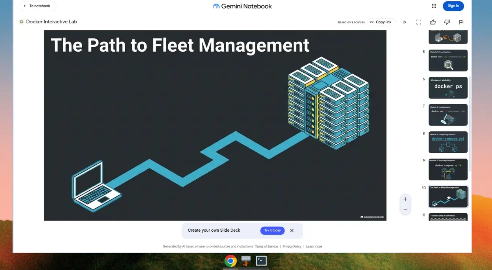

---

# Kubernetes, in one slide

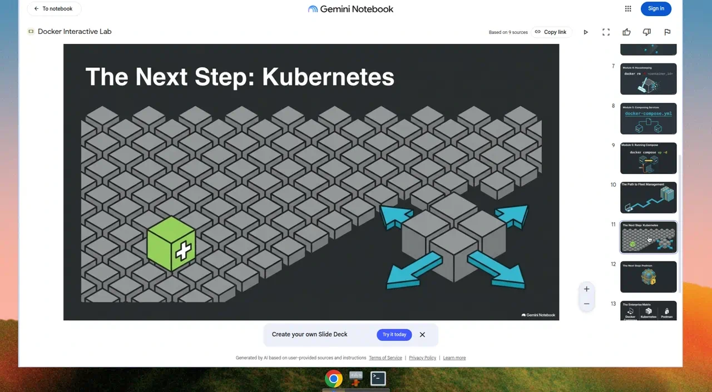

<p class="muted">Self-healing, autoscaling, the usual next step after Compose gets cramped.</p>

---

# Podman, in one slide

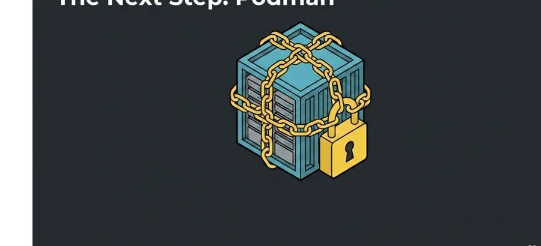

<p class="muted">Daemonless, rootless — same images, different engine.</p>

---

# Pick the tool for the job

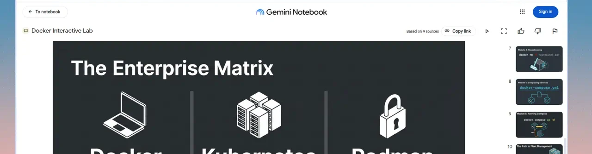

| Docker Compose | Kubernetes | Podman |
|---|---|---|
| Local / simple | Fleet / scale | Secure / daemonless |
| Sandbox & testing | High availability | Hardened production |

<p class="muted">This workshop stays on Compose. The other two are the map, not today’s hike.</p>
